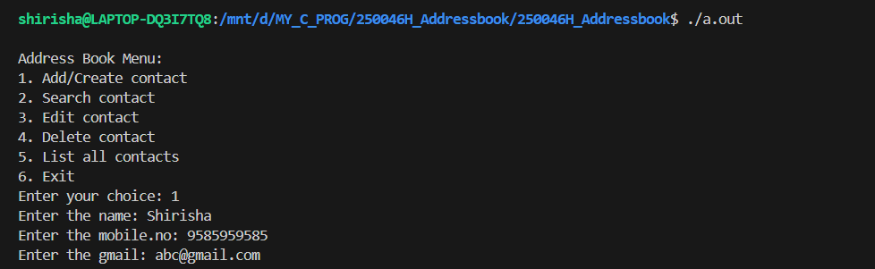
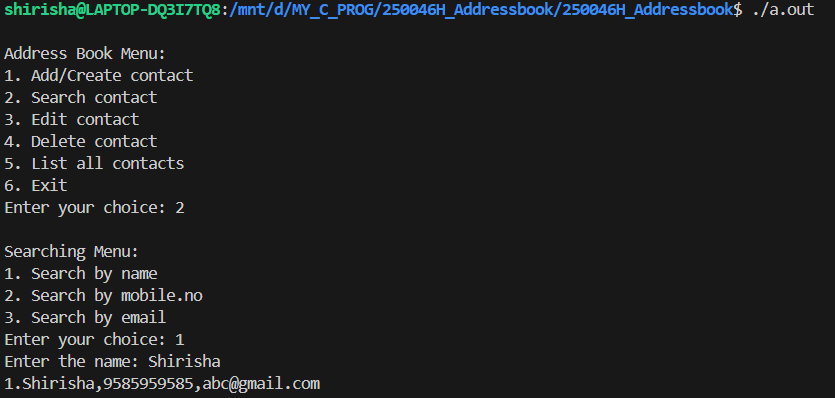
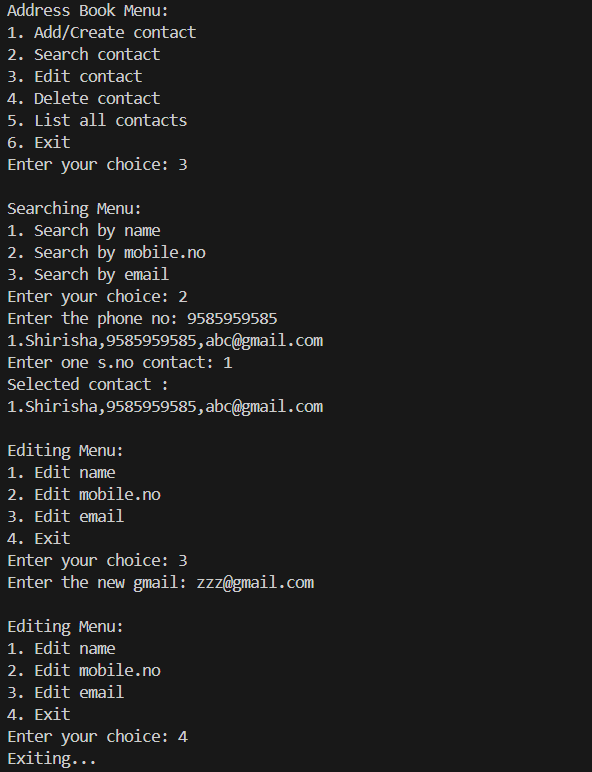
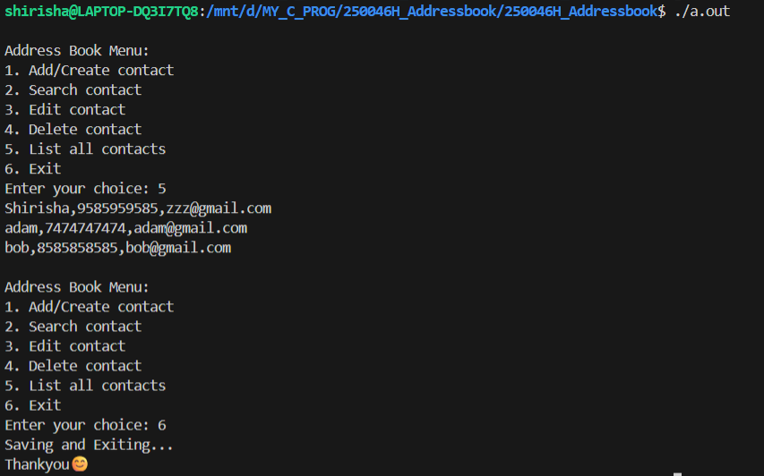
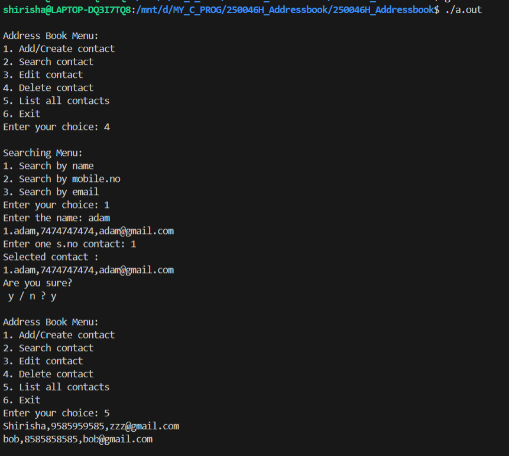
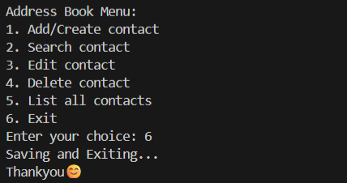

# Address Book Application in C

## Overview
This is a menu-driven Address Book application developed using the C programming language. The project supports adding, searching, editing, deleting, and listing contacts, with persistent storage implemented using a CSV file.

This project was developed as part of my Embedded Systems skill training at **Emertxe Information Technologies** under the **ESSCI CPR Program**.

---

## Features
- Add new contacts  
- Search contacts by name, phone number, or email ID  
- Edit existing contact details  
- Delete contacts from the address book  
- View all saved contacts  
- Persistent storage using a CSV file (`database.csv`)  

---

## Project Structure
├── main.c
├── addressbook.c
├── addressbook.h
├── database.csv

---

## How to Compile and Run

1. Compile the program using GCC:
gcc main.c addressbook.c -o address_book

2. Run the executable:
./address_book

---

## Dependencies
- GCC or any standard C compiler

---

## Notes
- The application reads from and writes data to `database.csv`
- Ensure `database.csv` is present in the same directory as the executable
- The CSV file enables persistent storage of contact information

---

## Learning Outcomes
- Hands-on experience with C programming  
- Improved understanding of structures, pointers, and modular programming  
- Practical knowledge of file handling and data validation  
- Experience in building a real-world console-based application  

---

## Screenshots

### Add Contact

### Search Contact

### Edit Contact

### List Contacts

### Delete Contact

### Exit

